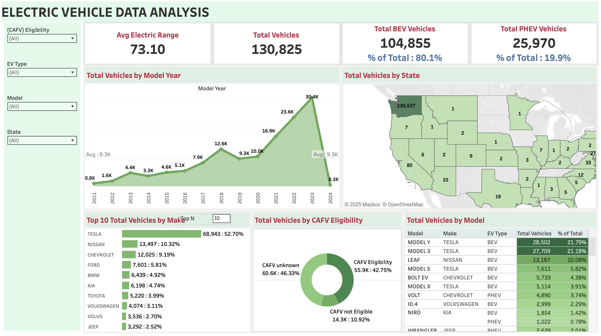

# ⚡ Electric Vehicle Data Analysis Dashboard with Tableau  

This repository contains a Tableau dashboard created using the **Electric Vehicle Population Dataset**.  
The dashboard provides insights into the growth, distribution, and adoption of electric vehicles across the United States.  

## 🚘 Key Insights  

- 🔋 **Average Electric Range** of vehicles  
- 🚗 **Total Vehicles**, including **BEVs** (Battery Electric Vehicles) & **PHEVs** (Plug-in Hybrid Electric Vehicles)  
- 📅 **Vehicles by Model Year** trend analysis  
- 🌍 **Vehicles by State** distribution (map view)  
- 🏭 **Top 10 Vehicle Makers** and their market share  
- ✅ **CAFV (Clean Alternative Fuel Vehicle) Eligibility** breakdown  
- 🚘 **Vehicles by Model** (Tesla, Nissan, Chevrolet, etc.)  

## 📊 Dashboard Preview  
  

## 🔗 Live Dashboard  
You can view the interactive dashboard here:  
👉 [Electric Vehicle Tableau Dashboard](https://public.tableau.com/app/profile/aliefiah.khambaty/viz/ElectricVehicle_17581072249630/Dashboard1?publish=yes)  

## 📂 Repository Contents  
- `EV_Dashboard.png` – Dashboard preview image  
- `Electric Vehicle.twb` – Tableau Workbook file  
- `Electric_Vehicle_Population_Data.csv.zip` – Dataset used  
- `Electric_Vehicle_Population_Data.xlsx` – Cleaned dataset in Excel format  
- `README.md` – Project documentation  

## 🛠 Tools Used  
- Tableau Public (for visualization)  
- Microsoft Excel (for data cleaning & preprocessing)  
- GitHub (for version control & sharing)  

---

✨ This project was built to explore **EV adoption trends** and practice **data visualization & dashboard storytelling** with real-world data.  
